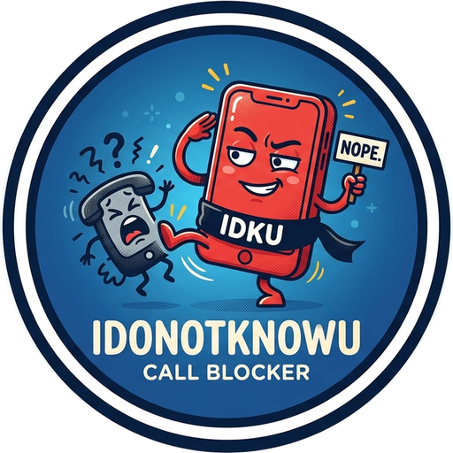

<p align="center">
  
</p>

# IDONOTKNOWU — Call Blocker

App Android que **rejeita em silêncio** as ligações de números que não estão nos seus contatos. Sem notificação, sem entrada no histórico de chamadas. Tudo acontece no aparelho, sem internet.

- Kotlin + Jetpack Compose, Android 10+ (minSdk 29).
- Não roda serviço próprio em segundo plano: o Android aciona o app a cada ligação recebida (`CallScreeningService`), então você pode fechá-lo depois de ativar.
- Números ocultos também são bloqueados.
- Se o app estiver desativado ou sem permissão de contatos, a ligação **passa** (nunca bloqueia tudo por engano).
- Tela "Ver bloqueadas" com o total e cada número que ligou.

## Instalação

1. Baixe o APK mais recente em **Releases**.
2. Permita a instalação de fontes desconhecidas quando o Android pedir.
3. Abra o app, toque em **Ativar**, conceda a permissão de contatos e aceite tornar o app o "app de identificação de chamadas".

**Samsung e outras marcas:** não force a parada do app e tire-o da lista de "apps em suspensão" da bateria, senão o sistema pode não acioná-lo.

## Desenvolvimento

```bash
export JAVA_HOME=~/tools/jdk-17.0.20.1+1 ANDROID_HOME=~/Android/Sdk   # ajuste ao seu ambiente
./gradlew assembleDebug                 # app/build/outputs/apk/debug/app-debug.apk
adb install -r app/build/outputs/apk/debug/app-debug.apk
```

### Testes e cobertura

```bash
./gradlew testDebugUnitTest                    # testes unitários (JUnit + Robolectric + Compose)
./gradlew createDebugUnitTestCoverageReport    # relatório JaCoCo
# abra app/build/reports/coverage/test/debug/index.html
```

Os testes cobrem a regra de bloqueio (`BlockPolicy`), a consulta de contatos, as preferências, o banco Room e as duas telas. Ficam sem cobertura o `CallBlockerService` (só a cola com o sistema, a decisão está em `BlockPolicy`) e o `MainActivity`; valide-os no aparelho ligando de um número não salvo e de um contato.

## Assinatura do APK release

O APK de debug não serve para distribuição. Gere uma chave **uma única vez** e guarde-a com backup: sem ela você não consegue publicar atualizações do mesmo app.

```bash
keytool -genkeypair -v -keystore ~/idonotknowu-release.jks \
  -alias idonotknowu -keyalg RSA -keysize 4096 -validity 10000
```

Crie o `keystore.properties` na raiz a partir do modelo (o arquivo e o `.jks` são ignorados pelo git):

```bash
cp keystore.properties.example keystore.properties   # edite storeFile e as senhas
```

Gere e confira o APK:

```bash
./gradlew assembleRelease
# app/build/outputs/apk/release/app-release.apk
$ANDROID_HOME/build-tools/<versão>/apksigner verify --print-certs app/build/outputs/apk/release/app-release.apk
```

Sem o `keystore.properties`, o build de release sai **sem assinatura** e não instala. Para uma nova versão, aumente `versionCode` e `versionName` em `app/build.gradle.kts`. Para a Play Store, use o mesmo esquema com `./gradlew bundleRelease` (AAB) e ative o Play App Signing.

## Política de privacidade

_Última atualização: 24/09/2026_

O IDONOTKNOWU respeita sua privacidade. Este aplicativo **não coleta, não envia e não compartilha** nenhum dado.

**O que o app acessa**
- **Contatos (`READ_CONTACTS`):** usado apenas para verificar, no momento de uma ligação, se o número está salvo na sua agenda. Os contatos não são copiados, armazenados nem enviados.
- **Número de quem liga:** o Android informa o número da ligação recebida ao app. Se a ligação for bloqueada, o número e o horário ficam salvos **somente no armazenamento local do seu aparelho**, para a tela "Ver bloqueadas".

**O que o app não faz**
- Não tem permissão de internet e não se comunica com nenhum servidor.
- Não usa anúncios, ferramentas de análise ou rastreadores.
- Não acessa histórico de chamadas, SMS, localização, microfone ou câmera.

**Seus dados e seu controle**
- Você pode desativar o app a qualquer momento pelo botão "Desativar".
- Desinstalar o app apaga todos os dados guardados, inclusive a lista de bloqueadas. Também dá para limpar em Configurações > Apps > IDONOTKNOWU > Armazenamento.

**Alterações:** mudanças nesta política serão publicadas neste arquivo, com a data atualizada.

**Contato:** [SEU E-MAIL DE CONTATO]

## Apoie o projeto ☕

Se o app te ajudou, pague um café por Pix. Escaneie o QR code ou use o Pix copia e cola abaixo.

<p align="center">
  
</p>

**Chave Pix (CPF):** `39028129820`

Pix copia e cola:

```
00020101021126330014BR.GOV.BCB.PIX0111390281298205204000053039865802BR5911IDONOTKNOWU6006BRASIL62070503***63045E2F
```

Obrigado! ☕
